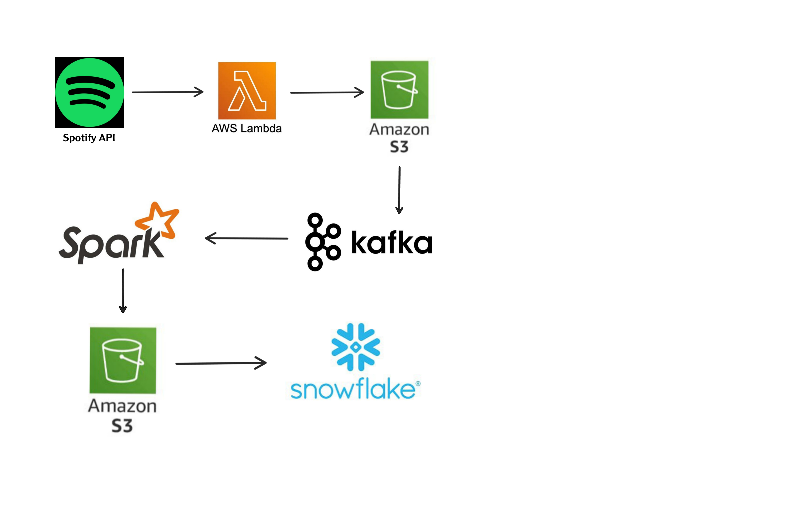

**Spotify Data Pipeline Project**

 🛠 **Technologies Used**

- Spotify API
- AWS Lambda
- Amazon S3
- Apache Kafka
- Spark
- Snowflake
- Python (Spotipy, Pandas, Boto3)

🧱 **Architecture**

   

📖 **Overview**

1. Data Extraction: AWS Lambda function using the Spotify API to fetch playlist data and store it as raw JSON in S3.
2. Data Transformation: Python script running in AWS Lambda processes raw JSON into structured album, artist, and song data and stores them back in S3.
3. Data Streaming: A Kafka producer script in PyCharm streams cleaned CSV data from S3 into a Kafka topic.
4. Data Consolidation: Final cleaned CSV is created by merging albums, artists, and songs, then uploaded to S3(`combined_spotify_data.csv`).
5. Data Loading: A Snowflake SQL script loads the cleaned CSV from S3 into a Snowflake table.

📌 **Conclusion**

This project demonstrates a complete Spotify data pipeline that integrates cloud services and modern data tools. From data extraction via the Spotify API to transformation, streaming, and 
loading into Snowflake, the pipeline ensures clean, query-ready music data. It showcases the power of AWS Lambda, S3, Kafka, and Snowflake working together for efficient, end-to-end data
processing.
